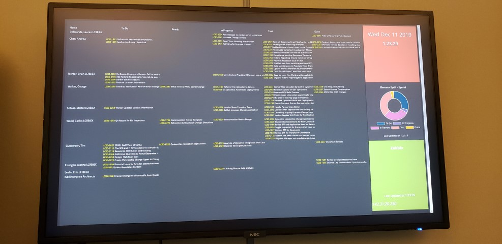

### Wallboard ###



This is a fairly simple wallboard with the following features:

1) JIRA Sprint Board with swim lanes for each participant in the sprint, and columns for popular statuses.    

2) A clock

3) A graphic summary of JIRA Sprint progress 

4) Zabbix problem display, shows current problems from a given Zabbix server.


It is meant to be run from a Rasberry Pi however can also run from any platform that supports Ruby.

The specific version of the Rasbery Pi that was used during development is the 3B+ with a 16GB micro SD card.  

This project was based on Smashing, see
http://smashing.github.io/smashing for more information.

The JIRA widget was based off the code by Matt Snider here: https://gist.github.com/matt-snider/be38718bc9ff3ee26f9c

The Zabbix widget was based off the code for a Zabbix trigger widget by Luis R. Lavina Jr. here:  https://gist.github.com/chojayr/7401426

Usage
-----

Set the following environment variables prior to running the wallboard 

| Variable | Description |
| ----- | ----------- |
|JIRA_USERNAME | Username that will be used to sign on to JIRA |
| JIRA_PASSWORD | Jira password |
| JIRA_URL | JIRA URL |
| JIRA_CUSTOMFIELD_STORYPOINTS | field that will be used for story points |
| JIRA_VIEW | ID of the saved view to use for the sprint board |
| ZABBIX_SERVER | Base URL of the zabbix server |
| ZABBIX_USERNAME | Zabbix username |
| ZABBIX_PASSWORD | Zabbix password |

This ruby software uses bundle.  Run `bundle install` to install dependencies.  If you don't have bundle then it can be installed using gem.

You may run the wallboard on a properly equipped environment by executing `smashing start` in the directory containing the files.

Raspberry Pi Setup
------------------

You can use git to clone this repository onto the pi.

It is recommended that you install ufw (firewall) onto the pi.  Configure ufw such that the only inbound port is for ssh.

Edit the file `~/.config/lxsession/LXDE-pi/autostart` to change the startup behavior of the pi.

Recommended autostart:
```
@lxpanel --profile LXDE-pi
@pcmanfm --desktop --profile LXDE-pi
@xset s off
@xset -dpms
@xset s noblank
@unclutter
@sed -i 's/"exited_cleanly": false/"exited_cleanly": true/' ~/.config/chromium/$
@/usr/bin/chromium-browser --noerrdialogs --disable-infobars --kiosk http://localhost:3030 &
@sudo xterm -hold ./wallboard.sh

```
This will turn off the pi screensaver, hide the cursor, open a browser in kiosk mode and start the wallboard server.  


`wallboard.sh` is a bash file that sets the necessary environment variables and runs smashing start in the appropriate directory.  For security reasons this file is not in the repo.

You may have to install unclutter, xterm, and chromium-browser using apt depending on your distribution of Linux on the pi.  It is also recommended to configure the pi for network time updates, as the pi does not have a real time clock.


License
-------

    Copyright 2019 George Walker

    Licensed under the Apache License, Version 2.0 (the "License");
    you may not use this file except in compliance with the License.
    You may obtain a copy of the License at 

       http://www.apache.org/licenses/LICENSE-2.0

    Unless required by applicable law or agreed to in writing, software
    distributed under the License is distributed on an "AS IS" BASIS,
    WITHOUT WARRANTIES OR CONDITIONS OF ANY KIND, either express or implied.
    See the License for the specific language governing permissions and
    limitations under the License.
